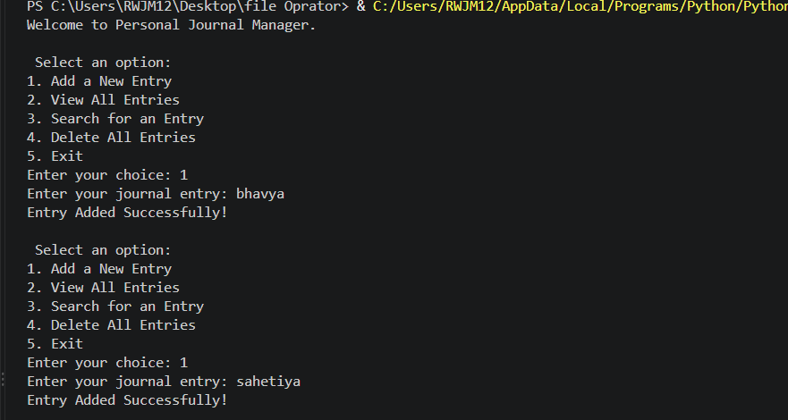

# Personal Journal Manager

## Subtitle of the Project

A simple Python-based Personal Journal Manager that allows users to create, view, search, and delete journal entries. The application stores all journal entries in a local journal.txt file.

## About the Project

This project is a beginner-friendly Python program that provides an interactive menu to manage personal journal entries.

The program allows the user to select from the following options:

* Add a new journal entry.
* View all journal entries.
* Search for a journal entry using a keyword.
* Delete all journal entries.
* Exit the program.

The program stores journal entries in a text file named `journal.txt`. Each entry is saved together with the current date and time.

The program continues displaying the menu until the user chooses the Exit option.

## Output



## Features

* Displays an interactive menu.
* Creates a `journal.txt` file if it does not already exist.
* Adds new journal entries to the text file.
* Stores the date and time with each journal entry.
* Displays all saved journal entries.
* Checks whether the journal file contains any entries.
* Searches journal entries using a keyword.
* Performs case-insensitive searching.
* Deletes all journal entries after user confirmation.
* Allows the user to cancel the delete operation.
* Uses a class to organize the journal operations.
* Uses exception handling with `try` and `except`.
* Uses a `while` loop to keep the menu running.
* Allows the user to exit the program.

## Learning Objectives

By completing this project, you can learn:

* How to take input from the user in Python.
* How to use variables and data types.
* How to create and use classes and objects.
* How to create a constructor using __init__().
* How to create and call instance methods.
* How to use the datetime module.
* How to get the current date and time using datetime.now().
* How to create and manage text files.
* How to open files in different modes.
* How to read, write, and append data in a file.
* How to search text inside file data.
* How to use string methods such as lower().
* How to use try and except for exception handling.
* How to use if, elif, and else statements.
* How to use for and while loops.
* How to create a menu-driven Python program.
* How to store data permanently using a text file.
* How to control program flow based on user choices.

## Built-in Functions and Methods Used

* `open()`
* `input()`
* `print()`
* `str()`
* `int()`
* `lower()`
* `read()`
* `readlines()`
* `write()`
* `close()`

## Technology Used

* Python
* Visual Studio Code (VS Code)
* Git
* GitHub

## How to Run

### Step 1: Install Python

```bash

https://www.python.org/downloads/
```

### Step 2: Run the Program

```bash
python main.py
```

## Project Structure
```text
│
├── journal.txt
├── main.py
├── output.png
└── README.md
```

## Important Notes

* Journal entries are saved in journal.txt.
* The journal file is created automatically if it does not exist.
* Searching is case-insensitive.
* Choosing Delete All Entries permanently removes all saved entries from the file.
* The program is designed as a beginner-friendly Python project for learning file handling and classes


## Concepts Used

* Variables and data types.
* User input.
* Type conversion.
* Strings.
* File handling.
* Creating files.
* Reading files.
* Appending data to files.
* Writing data to files.
* Reading multiple lines using `readlines()`.
* Classes and objects.
* Constructor method `__init__()`.
* Instance methods.
* `datetime` module.
* `datetime.now()`.
* `try` and `except`.
* If, elif, and else statements.
* For and while loops.
* String methods such as `lower()`.
* Menu-driven programming.

## Author

Bhavya Sahetiya